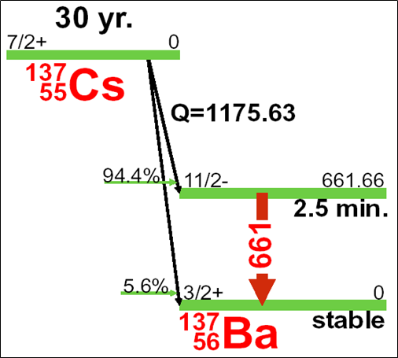
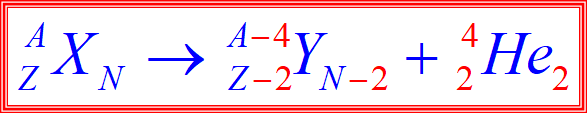

# task6

### 1.根据L6回答 (5分)

（一）由L6P8，解释绝对强度和分支比的区别。

（二）随着原子核的激发能级的提高（例如从第n激发态来到第n+1激发态），能级的半衰期通常是减小的，与此同时，能级宽度会怎么变？

（三）若某射线源在衰变时会发射某粒子a，则活度1Bq的该源，平均每秒发射1个a粒子，对吗？

（四）在三种平衡关系中，如果母子核的半衰期相差比较大，则tm时刻主要由谁决定？

（五）在tm时刻，母子核的活度关系存在什么特点？

- *Hint:* （一）核素不同；（三）我衰变≠我放出一个a粒子；（四）半衰期较短的决定；（五）活度相等

### 2.填空题 (2分)

在制备放射源的时候，影响放射源的活度的因素有几个？，当照射的时间足够长之后，影响因素会退化成几个？。（请用阿拉伯数字填写）

- *Answer:* **5** **3**

###  3.主观题 (1分)

在下面这个衰变中，存在类似99Mo-99mTc的“母牛”吗？请解释一下。

- *Hint:* **存在，长期平衡**

### 4.主观题 (1分)

下面的α衰变之后，如果α粒子的动能为Eα，Y核的动能为Eα/58，则A是多少，为什么（假设母核X静止）？

- *Hint:* **动量守恒**

- *Answer:* **A=236，过程略**

### 5.单选题 (1分)

沿着β稳定曲线向高Z区移动的时候，遇到某个处于基态的高Z核素A，若知道A发生α衰变后产生子核B，则B不会发生下面哪种衰变？

1. γ跃迁
2. α衰变
3. β-衰变
4. β+衰变

- *Hint:* 核素的β稳定曲线

- *Answer:* **β+衰变**
