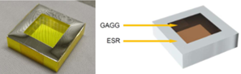
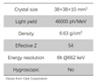
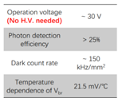
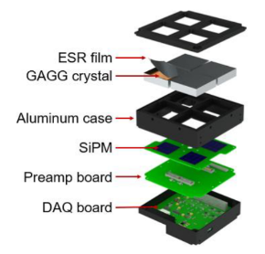
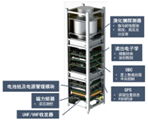
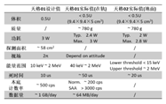
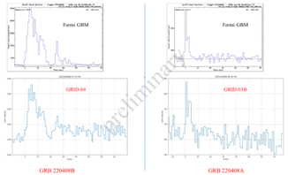

# 核技术在空间天文中的应用-天格计划

## 背景目标

伽马射线暴是目前已知最剧烈的天体物理过程，产生自极端能量密度环境。伽马射线暴可能起源于超新星爆发、中子星并和等物理过程，与热核聚变、引力波等前沿物理问题相关。

天格计划提出利用立方星搭载小型探测器，多星组网探测宇宙伽马暴。通过创新探测原理（测量伽马射线暴的高亮度），从而实现低成本探测伽马射线暴。

## 探测方式

伽马射线暴放出的粒子经溴化镧探测器探测后转换为电信号，经电子学设备转换后变为数据并传输至地面，在地面对数据经行进一步处理。当探测到的粒子数有较大变化时可以认为有伽马射线暴发生。

## 探测仪器

1. ESR&GAGG

 

闪烁体，用于将辐射粒子转换为光信号，并将光信号转变为电信号。

2. SiPM

 

SiPM（光电倍增管），将较弱的电信号变成可以处理的电信号。

3. Preamp board & DAQ board

对采集到的电信号进行处理，使用uC/OS-III(Micro C OS Three 微型的C
语言编写的操作系统第3版)操作系统处理信号得到数据，并通过后续装置将数据传输至地面。

4. 最终成品与参数

 

## 获得成果

 

GRB210121A是国际上首例由纳卫星伽马暴探测器探测到、取得科学发现和论文发表的伽马暴事例,证明了天格计划的可行性，同时发表论文

天格计划（GRID-02）所得捕获粒子量略低于其他卫星，但是粒子数-时间图像与其他大科学卫星相似。由此可见GRID-02卫星可以较精确的探测到伽马射线暴的发生­^\[2\]^。后来的GRID-03B与GRID-04与美国的费米卫星进行对比，天格卫星依旧保持了良好的探测准确度。

目前，天格计划与GeCAM合作进行更多的与伽马射线暴有关的探测任务。

## 参考资料

1. https://learn.tsinghua.edu.cn/b/wlxt/kj/wlkc_kjxxb/student/downloadFile?sfgk=0&\_csrf=c2ca2301-d55a-4afd-9ebb-9bc3b76411bd&wjid=2011990054_KJ_1664592751266122a226de7-8d40-4a57-96a1-31ae77dde37e

2. J. Iwanowska et al., Performance of cerium-doped Gd3Al2Ga3O12 (GAGG) scintillator in gamma-ray spectrometry.Nucl. Instrum. Methods Phys. Res. Sect. A. 712, 34--40 (2013)

3. X.I. Wang, X. Zheng, S. Xiao, et al., GRB 210121A: A Typical Fireball Burst Detected by Two Small Missions, ApJ. 922 (2021) 237.
