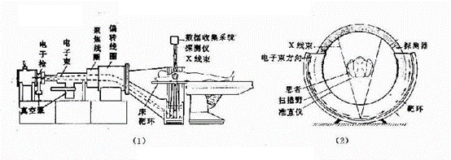

# CT的工作原理及其应用现状

## 工作原理

### 1. 结构组成

一个CT装置一般包含放射源、探测仪、数据处理系统、显示器等

放射源发射X射线，经人体吸收后剩下部分被探测仪探测。在多角度测量后，通过计算可以得出人体内部的结构。

目前的CT仪一般如图所示，为环绕一圈的探测器以及一个可以旋转移动的放射源，通过移动放射源来达到多角度探测的目的

### 2. 数据获取

1.根据朗伯---比尔 (Lambert-Beer law) 定理可知，单能 X 射线穿过均匀物体时
X 射线强度的衰减可由以下公式表达：

$$I = I_{0}e^{- \mu l}$$

$$I_{0}表示射线源的X光强度，I表示探测器探测到的X光强度$$

$$\mu 为物体的衰减系数，l为物体厚度$$

当物体含有多种不同的物质时，则满足：

$$I = I_{0}e^{- \int_{0}^{l}{\mu(l)dl}}$$

$$I_{0}表示射线源的X光强度，I表示探测器探测到的X光强度$$

$$\mu 为物体的衰减系数，l为物体厚度$$

2.然后使用Radon变换：

Radon变换是一个积分变换，定位在二维平面上的一个函数沿着平面上任意一条直线做线积分。

在y轴上投影$R(y) = \int_{- \infty}^{\infty}{f(x,y)dx}$

在x轴上投影$R(y) = \int_{- \infty}^{\infty}{f(x,y)dy}$\
当旋转时：

考虑坐标变换

$$
\begin{cases}
x' = x\cos(\theta) - y\sin(\theta), \\
y' = x\sin(\theta) + y\cos(\theta).
\end{cases}
$$

得到在$x^{'}$轴上的投影

> $R_{\theta}\left( x^{'} \right) = \int_{- \infty}^{\infty}{f(x^{'}\cos(\theta) + y^{'}\sin(\theta), - x^{'}\sin(\theta) + y'cos(\theta))dy'}$

通过该变换函数，可以模拟计算出扫描仪对物体的扫描结果。

### 3. 数据处理

数据处理一般有3种方式：

1\. 直接反投影法（古老，较少使用）：

> 如上述操作得到图像，但是仅使用此算法会导致图像模糊，故被放弃使用。

2\. 滤波反投影重建算法（FBP）（目前最常用）：

> 1\. 将原始投影进行一次一维傅立叶变换\
> 2.设计合适的滤波器，在$\varphi_{i}$的角度下将得到原始投影$p\left( x_{r},\varphi_{i} \right)$进行卷积滤波，得到滤波后的投影。\
> 3.将滤波后的投影进行反投影，得到满足$x_{r} = r\cos\left( \theta\ –\ \varphi_{i} \right)$方向上的原图像的密度。\
> 4. 将所有反投影进行叠加，得到重建后的投影。
> 5. 迭代重建技术(ART)（较新，计算量巨大）：
> 对三维体素进行重建后，通过迭代得到更精细的图像，会涉及以下技术

- 代数迭代重建技术（ART, algebraic reconstruction technique)

- 最大期望极大似然算法（ML-EM，Maximum-Likelihood
Expectation-Maximization）

在对数据处理得到原始物质CT值分布后，对比常见物质的CT值即可得到物体组成：

## 应用现状

### 1. CT灌注成像

CT灌注成像不同于动态扫描,是在静脉快速团注对比剂时，对感兴趣区层面进行连续CT扫描，从而获得感兴趣区时间-密度曲线,并利用不同的数学模型，计算出各种灌注参数值，因此能更有效、并量化反映局部组织血流灌注量的改变，这是一种CT应用领域的前沿科技，对明确病灶的血液供应具有重要意义，在脑梗塞的早期发现上有广泛运用。

### 2. CT心脏成像

CT心脏血管成像也称冠状动脉增强CT，通过注射增强的显影剂，显影剂沿血管流到心脏冠状动脉，使冠状动脉显影之后在多源的多层CT扫描的情况下，显影整个心脏的血管，再经过图像的重建清晰显示整个心脏血管是否堵塞，以及整个心脏血管的走形是否正常的检查。

### 3. 基于CT的虚拟内窥镜

虚拟内窥镜是一种三维可视化工具，通过计算机对CT等医学图像的处理可以生成人体内部特定解剖结构的虚拟视图，从而模拟出传统内窥镜的视觉效果。

### 4. 多层螺旋CT在尸体检查中的应用

对尸体进行CT扫描可以更加快速准确地得到尸检结果，并尽可能保护尸体完整。

### 5. CT能谱技术

随着X线能量的变化，不同的物质会呈现出不同的X线吸收衰减能力，即每种物质都有其特征性的X线吸收曲线，根据此原理可以获得能谱曲线。不同组织结构与病理类型具有不同的能谱曲线，相似的能谱曲线可以提示相同或相似的组织结构与病理类型。可以用于小病灶、低对比结构及微细结构的显示。

## 参考资料

1. 黄辉,黎丽,张俊安.CT的工作原理及新应用研究进展.医疗装备,2022,35(12):190-193.

2. <https://www.zhihu.com/question/24978900/answer/252728892>

3. <https://blog.csdn.net/qq_33414271/article/details/78128813>

4. <https://www.cn-healthcare.com/articlewm/20220818/content-1420248.html>

5. <https://blog.csdn.net/sharon_1995/article/details/109655401>

6. <https://baike.baidu.com/item/CT%E7%81%8C%E6%B3%A8%E6%88%90%E5%83%8F/9228606>
