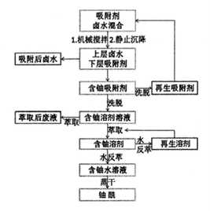

# 核燃料循环前段：非常规铀资源提取 ——盐湖卤水中铀的分离

## 提取概述

海洋、盐湖等水系中含有大量铀，是重要的铀资源。从盐湖或海水中吸附铀的方法有多

种，其中，吸附法研究最多、也最可行。

适于从盐湖卤水或海水中吸附铀的吸附剂应具备以下特征：

> （１）平衡吸附量大；
>
> （２）吸附动力学快；
>
> （３）对铀的选择性高；
>
> （４）吸附的铀易快速解吸；
>
> （５）具有良好的化学稳定性与机械强度

由此产生了多种以吸附为主要原理的从盐湖中提取U的方式。一般，通过以下路径即可将U萃取，并得到一定浓度的U。

提高吸附材料的选择性对提高U的浓度极为重要。因此首先要了解吸附剂与吸附质之间的作用方式。吸附剂可能通过以下几种方式与吸附质相互作用：范德华力、静电吸引、氢键作用、络合作用。

范德华力是极弱的作用力，很难在选择性吸附铀的过程中发挥作用。盐湖卤水中存在的大量阳离子，而且浓度远远高于铀的浓度，大量共存的阳离子与吸附剂之间的静电吸引使得微量存在的铀酰离子无法通过此方式被吸附。铀酰离子不易形成氢键，直接利用氢键作用进行选择性铀吸附很困难。

因此，只有铀酰离子先与某种配体形成配合物，通过配体与吸附剂之间的氢键作用才有可能利用氢键进行盐湖中铀的吸附。络合作用基于Lewis
理论，是一种电荷转移作用，通过共享电子形成化学键，通过络合作用有可能实现铀的选择性吸附。因此，将对铀具有较好亲和作用的基团修饰到吸附剂的表面，能够有效改善传统吸附剂对铀的选择性吸附。

目前，有以下多种提取剂：

1. 氨基酸功能基高分子

> LPPD吸附铀后可用1mol/L稀盐酸溶液解吸，解吸率达98.5％。从某盐湖水体中直接吸附铀时，吸附量可达2.06mg/g

2. 接枝法制备偕胺肟基介孔氧化硅

> 吸附剂用量为 0.4 g/L，吸附时间为 24 小时实验条件下，Si-AO 对 G12-02h和
> G12-03 中铀的吸附效果高于 95%，吸附容量分别为 0.53 mg/g 和 0.97 mg/g。

3. 共交联法制备偕胺肟基介孔氧化硅（AMCM-0.4）

> AMCM-0.4对开发钾肥过程中的盐田水中铀的吸附容量可达3.4
> mg/g，是目前对真实盐湖水和海水中铀吸附容量最高的材料之一。

## 现实应用

相同实验条件下，共交联法制备的偕胺肟基介孔氧化硅对铀的吸附容量高于接枝法制备的偕胺肟基介孔氧化硅以及氨基酸功能基高分子。可见，共交联法制备偕胺肟基介孔氧化硅更适合用于U的提取

青海尕斯库勒湖表水中铀浓度为 200 μg/L
左右，在开发利用盐湖资源过程中，盐湖卤水中的铀逐渐被富集。目前人们将通过日晒蒸发工艺开采盐湖资源完毕后的老卤水以废水的形式暂存于老卤池中，其中铀的浓度则是湖表水的两倍以上。老卤池中铀的浓度更高，用吸附法进行铀的富集更为经济合理。另外，随着老卤水的不断增加，老卤池中的铀不断地被富集，铀浓度就会增加，这就可能对环境造成放射性的影响。综合以上因素，老卤水是盐湖铀资源开发的最佳水源。

## 未来前景

我国海水提铀将实施"三步走"战略路线：第一阶段（2021-2025），实现海水中提取公斤级铀产品能力；第二阶段（2026-2035），建成海水提铀吨级示范工程；第三阶段（2036-2050），实现海水中提取铀产品连续生产能力。

## 参考资料

1. 任宇,陈树森,勾阳飞,宿延涛,苏学斌,陈梅芳,曾广军.氨基酸功能基高分子吸附剂的制备及从盐湖卤水中吸附铀\湿法冶金,2022,41(04):317-323.DOI:10.13355/j.cnki.sfyj.2022.04.007.

2. 殷小杰. 盐湖卤水中铀的分离提取研究.兰州大学,2017.

3. 中国能源报. 人民网.  2021年5月10日. http://paper.people.com.cn/zgnyb/html/2021-05/10/node_2233.htm. ISBN.
