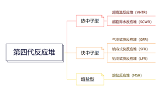
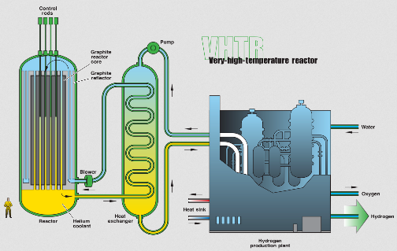
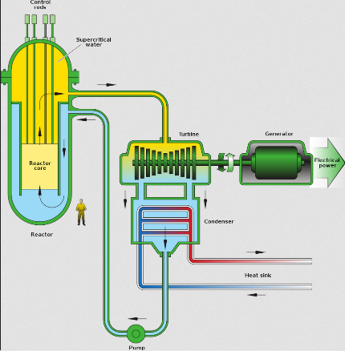
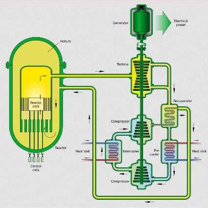
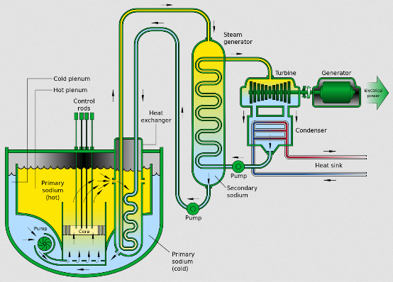
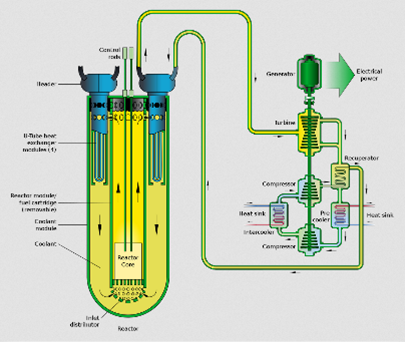
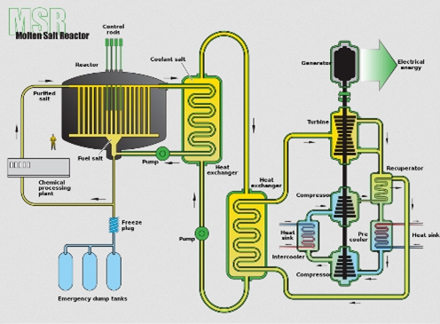

# 第四代反应堆

## 概念及现状

第四代反应堆是一系列研究中的理论反应堆设计，其设计特征为：

>核能的可持续利用
>
>经济性、安全与可靠性
>
>防扩散与实物保护

除了BN-1200反应炉（英语：BN-1200 reactor），多数方案被认为在2030-2040年前不可能付诸商业运转，高温气冷堆技术方案的石岛湾核电站预计2017年并网发电，拖延至2021年并网发电。目前商转中的反应炉大多是第二代反应炉、以及只有十几个第三代反应炉(2014年)，绝大部分的第一代系统已退役。

## 反应堆类型

### 超高温反应堆

超高温反应堆（Very high temperature reactor，缩写：VHTR）的设计概念是运用石墨作为减速剂、一次性铀燃料循环、氦气或熔盐作为冷却剂。此设计设想出水口温度可达1000°C，堆芯则可采燃料束或球床式。借由热化学的硫碘循环，反应堆高温可用于产热或产氢制程。超高温反应堆也具有非能动安全特性，天然具有不可能发生核灾的安全度。

第一个实验性VHTR在南非建成南非球床模组反应堆，但已于2010年2月停止挹注资金。成本提高与难以突破的技术困难，使投资人与消费者踌躇不前。但2010年后中国认为技术已经突破，先建成10兆瓦高温气冷实验堆之后迅速于石岛湾核电站开建商用模组，石岛湾核电站已经于2021年9月12日成功临界，2021年12月20日并网发电

### 超临界水反应堆

超临界水堆（Supercritical water reactor，缩写：SCWR）使用超临界水作为工作流体。SCWR是以轻水反应堆（LWR）为基础，运作于高温高压环境，采取直接、一次性循环。最初的设想是：采取如同沸水反应堆（BWR）的直接循环。但在改用超临界水作为工作流体后，水便为单一相态，类似压水反应堆（PWR）。SCWR的可运作温度比BWR与PWR还高。

由于SCWR具有较高的热效率与简单的设计结构，成为倍受关注的新式核反应堆系统。目前SCWR主要目标是降低发电成本。

SCWR是以两种科技为基础进一步发展而成：轻水反应堆与超临界蒸气锅炉。前者是世界上大部分商转中的反应堆类型；后者也是常用的蒸汽锅炉类别。

### 气冷式快反应堆

气冷式快反应堆（Gas-cooled fast reactor，缩写：GFR）是种快中子反应堆。利用快中子、封闭式核燃料循环对增殖性材料进行高效核转换，并控制锕系元素核裂变产物。使用出口温度850°C的氦气冷却，送入直接布雷顿循环的封闭循环气涡轮发电。许多新式核燃料能确保运作于高温中，并控制核裂变产物产出：混和陶瓷燃料、先进燃料微粒或锕系化合物陶瓷护套燃料。堆芯燃料会以针状、盘状集束或柱状分布。

### 钠冷式快反应堆

钠冷式快反应堆（Sodium-cooled fast reactor，缩写：SFR）是以另两种反应堆：液体金属快中子增殖反应堆与一体化快反应堆为基础延伸而来。

SFR的目的是增加铀滋生钚的效率和减少超铀元素同位素的累积。反应堆设计一个未减速的快中子堆芯将长半衰期超铀元素同位素消耗掉，并会在反应堆过热时中断连锁反应，属于一种非能动安全系统。

SFR设计概念是以液态钠冷却、钚铀合金为燃料。燃料装入铁护套中，并于护套层填入液态钠，再组合成燃料束。这种燃料处理方式所遇到的挑战是钠的活性问题，因为钠与水接触会产生爆炸燃烧。然而，使用液态金属（如钠钾合金）取代水作为冷却剂可以减低这种风险。另有一种新型行波反应堆(TWR)的钠冷概念开始被讨论，可以利用各种废核料运转甚至自己的废核料，使开动后上百年自行运作，但科技复杂度造成从未有人建造过，实践性尚在研究。

在2014年，中国首座钠冷快中子反应堆，中国实验快堆12月15日17时首次达到100％功率，18日17时实现满功率稳定运行72小时。其主要工艺参数和安全性能指标达到设计要求。

### 铅冷式快反应堆

铅冷式快反应堆（Lead-cooled fast reactor，缩写：LFR）是一种以液态铅或铅铋共晶冷却的反应堆设计，采封闭式核燃料循环，燃料周期长。单一堆芯功率约50至150兆瓦，模组可达300至400兆瓦，整座电厂则约1200兆瓦。核燃料是增殖性铀与超铀元素的金属或氮化物合金。LFR以自然热对流冷却，冷却剂出口温度约550°C至800°C。也可利用反应堆高温进行热化学反应产氢。

### 熔盐反应堆

熔盐反应堆（英语：Molten Salt Reactor，缩写：MSR）是一种反应堆类型，其冷却剂甚至是燃料本身皆是熔盐混和物。这有许多不同细部设计的延伸型，目前也已建造了几个实验原型炉。最初和目前广泛采用的概念，是核燃料溶于氟化物中形成金属盐类，如：四氟化铀（UF4）和四氟化钍（ThF4）。当燃料熔盐流体流入以石墨减速的堆芯内时，会达到临界质量。现行大部分设计是将熔盐燃料均匀分散在石墨基体中，提供低压、高温的冷却方式。

有一种液相氟化钍反应炉（英语：Liquid fluoride thorium reactor）（LFTR）是一种热滋生钍燃料发电，舍弃铀矿使用钍熔盐作钍燃料循环（英语：Thorium fuel cycle），可在常压下达到高运作温度，此新式观念已在世界上引起关注。

甘肃杜威的钍基熔盐堆预计于2021年9月底试运行。2022年8月2日，中华人民共和国生态环境部公开通知：《关于批准\<2MWt液态燃料钍基熔盐实验堆调试大纲\>（V1.3版）的通知》，通知体现出甘肃杜威钍基熔盐堆正处于调试阶段。

## 优点与缺点

>相对于现行核电站技术，第四代反应堆有以下优点：
>
>核废料仍有放射性，但半衰期已从数百万年降至数百年。
>
>使用新式设计后，同样数量的核燃料多产出100至300倍的能量。
>
>可利用现有核废料产电。
>
>大幅改善运转安全性。

一种无法预测的问题是当操作员对新式反应堆运作不熟悉时，可能会有较高风险。核工程师大卫·洛克博姆认为大部分的核事故都是这样造成的，他说："我们无法模拟操作员会犯怎样的错误"。美国某研究实验室主任说："生产、建造、维护新式核电站会面临新的学习问题，也许技术证明可行，但人类却会犯错"。

另一种特殊风险可能会发生在钠冷式快反应堆上，因为钠与水接触会产生爆炸，修缮输水管线会变得非常危险。为了改善这个问题，可在修缮时使用氩气避免钠被氧化，但却可能造成工人缺氧窒息。日本的文殊增殖反应堆有测试过相关问题的解决方案。

## 参考资料

1. <http://www.heneng.net.cn/index.php?mod=news&category_id=39&action=show&article_id=51193>

2. <https://zh.m.wikipedia.org/zh-sg/%E7%AC%AC%E5%9B%9B%E4%BB%A3%E5%8F%8D%E6%87%89%E5%A0%86>

3. <https://mp.weixin.qq.com/s?src=11&timestamp=1633067249&ver=3347&signature=dVjluZ1QyT8DYtuD00ptHef2cPzCmKJIYVbk-g9nnQcIynogBw5Ip9-RQ3knBa2nMJf4v*mFjtDiFVADNBIz2vS7iI-5zq5x9xEb0FFMcwOZMaco01ehSMFJGvgHYAqB&new=1>

4. <https://www.cnnpn.cn/article/21881.html>
