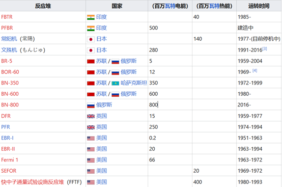
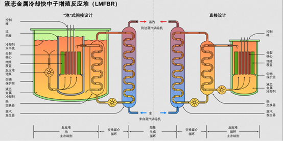

# 第三/四代反应堆  ——快中子增殖反应堆

## 概念

快中子增殖反应堆（Fast breeder
reactor），或称快中子滋生反应堆、快滋生反应堆、快堆等，是一种核子反应器，核燃料和一颗快中子在核分裂后产生更多的中子，且利用增殖性材料吸收快中子后形成可裂变物质，产生的燃料多于消耗的燃料。另外也有利用热中子进行滋生反应的"热滋生反应器"。

## 历史

快中子增殖反应器的想法始于第二次世界大战的原子弹计划。战争结束后的二十年间，苏联、英国、法国、德国、日本和印度跟随美国的脚步研发快中子增殖反应器。大部分国家都使用液态钠或钠钾合金作为冷却剂，即钠冷快中子反应堆，发电原理和压水反应堆相似，都是冷却剂从反应堆带出热能，经过蒸气产生器产生蒸气驱动涡轮机和发电机产生电力。但和压水反应堆不同的是，钠冷快中子反应堆的冷却剂的温度控制在883℃（钠的沸点），压力也不需要太高。但钠冷快中子反应堆遇到最大的问题是钠极易和空气与水产生激烈反应，几乎所有的钠冷快中子反应堆都遇过冷却剂泄漏引起火灾的事件。而且维护一个含有大量液态钠的反应器困难且耗时，因此建好的钠冷快中子反应堆大部分的时间都在停机维修。目前美国、英国、法国和德国都已停止研发快中子增殖反应器，只有印度、俄罗斯和中国等国家仍有研发的计划。

世界上主要的实验性或是示范性快中子增殖反应堆：

## 原理

快中子增殖反应堆的装置图：

核燃料中包含两种成分，一种是如铀-235、钚-239等容易产生分裂的同位素，称为"可裂变物质"，另一种是如铀-238等的，捕捉到一个中子后可以转变为相对应的可裂变物质，因此称为"增殖性材料"，如铀-238可转变为钚-239，钍-232可转变为铀-233。

核燃料进行裂变反应时，每次的裂变会产生2到3个中子，如果反应器的核裂变都将由快中子所诱发，这类的反应器就称为快中子反应器。快中子有的会逃出核心、被其它材料吸收或被燃料本身吸收，若能有至少一个中子能再诱发分裂，核反应就能持续下去，形成链反应。而在反应器中，可裂变物质一方面因分裂而消耗，另一方面却因增殖性材料捕获中子变为可裂变物质而增加，若增加的速度快过消耗的速度，这种反应器就称为滋生反应器。

由于快中子反应器的中子未经任何核反应就离开炉心比例较大，因此炉心外围会包上一层由增殖性材料组成的围包（blanker）。增殖性材料吸收由核心逃离出来的中子后，转变为可裂变物质，可搜集作为下一座快中子反应器的核燃料。由于是将原本不足以进行连锁反应的材料变成可以使用的材料，因此有增加铀矿利用率100倍的可能性，对于核燃料有限的问题有很大的帮助。

另一方面，需尽量增加每个中子诱发分裂而释放出来的中子数（称为η值），理论上至少要达到2，若中子没有消耗，则其中一个用于诱发下一个核分裂，另一个则被增殖性材料吸收，这样可裂变物质增加的速度才能刚好等于消耗速度，由此可知滋生反应器的η值必须大于2。以铀-235、钚-239和铀-233等做为可裂变物质的η值，在快中子反应器中分别为2.10、2.45和2.31，且铀-238也是含量最多的铀同位素，故大部分发展快中子增殖反应堆的国家都以钚-239为可裂变物质，以铀-238为增殖性材料。只有苏联是用20-30%的铀-235作为可裂变物质。

## 优缺点

### 钠冷快中子反应堆

优点

- 反应堆内无需维持高压。

- 液态钠热焓高，反应堆功率密度高。

技术瓶颈

- 建造成本很高。

- 钠接触空气会迅速氧化。

- 钠接触水或空气会迅速燃烧爆炸。

- 目前世界上液态钠快滋生反应堆皆失败于钠泄漏之燃烧。

### 液态铅(铅/铋)快滋生反应堆

优点

- 铅/铋比钠有更小的中子吸收截面。

- 可设计为装置容量1200MWe等级的大型核电厂 。

- 非常长的更换燃料周期。

- 反应堆内无需维持高压。

- 液态铅热焓高，反应堆功率密度高。

技术瓶颈

- 铅融点为327℃，不容易液化，故必须刻意保持在液化状态。

- 铅蒸汽有剧毒，运转人员的安全堪虑。

- 建造成本较其他反应堆更高。

- 铅密度较大，质量可能大于其他反应堆，在抗地震方面有疑虑。

- 铅接触空气会氧化，化学特性会改变。

## 参考资料

1. <https://zh.m.wikipedia.org/zh-sg/%E5%BF%AB%E4%B8%AD%E5%AD%90%E5%A2%9E%E6%AE%96%E5%8F%8D%E5%BA%94%E5%A0%86>

2. <http://fissilematerials.org/library/rr08.pdf>

3. <https://www.jaea.go.jp/04/turuga/monju_site/>

4. <https://www.researchgate.net/publication/273836843_Prolongation_of_the_BOR-60_reactor_operation>

5. <http://archived.chns.org/s.php@page=12&id=34&id2=1211.html>

6. <http://www.guancha.cn/economy/2016_10_06_376258.shtml>
