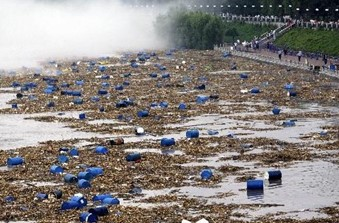
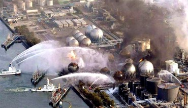

# 突发事件及其链式效应介绍

## 引言

自美国"9·11"事件以来，国际社会对于公众安全与应急管理的重视度迅速提升，突发事件的应当对成为各国政府、公众以及专家重新思考的问题。其中突发事件及其链式效应成为了学界所重点关注的问题之一。

在突发事件带来的挑战背后，突发事件的次生衍生现象近年来也呈现复杂程度加剧，危害程度上升等趋势。大量案例研究表明，突发事件在发生发展演化的进程中，常常会从一个初始原生事件，逐渐演变成具有次生衍生灾害的复杂事件，甚至次生衍生事件的后果和应对难度可鞥会超过原生初始事件本身。因此研究事件之间次生衍生的关系，对次生衍生事件及其后果进行早期预测、实现控制、评估风险等便成为了研究重点，由此发展出了突发事件的链式效应理论，旨在解释原生突发事件及其衍生事件之间的关系，以对更好地应对公共安全事件提供理论指导。

## 突发事件次生衍生问题实例

1）2005年松花江水污染事件

2005年11月13日，吉林石化公司双苯厂一车间发生爆炸，约100吨苯类物质（苯、硝基苯等）流入松花江，造成了江水严重污染，沿岸数百万居民的生活受到影响。此次爆炸导致松花江江面上产生一条长达80公里的污染带，主要由苯和硝基苯组成。污染带通过哈尔滨市，该市经历长达五天的停水，是一起工业灾难。同时，由于地处中俄边境，此次爆炸也使得俄罗斯方面水源受到污染，导致了外交上的困难。

2）2011年日本福岛核电站泄露事件

2011年3月11日日本东北太平洋地区发生里氏9.0级地震，继发生海啸，该地震导致福岛第一核电站、福岛第二核电站受到严重的影响。海啸及其夹带的大量废物对福岛第一核电厂现场的厂房、门、道路、储存罐和其它厂内基础设施造成重大破坏。进而导致核电站丧失了把堆芯热量排到最终热阱的手段，福岛第一核电厂1、2、3、4号机组在堆芯余热的作用下迅速升温，锆金属包壳在高温下与水作用产生了大量氢气，随后引发了一系列爆炸。之后由于日本方面处置不当，选择将海水注入融毁的堆芯降温，导致了大量海水被污染。

总的来说，从这几件突发公众安全事件的发展演化进程中可以看出，由原始时间引发的一系列次生衍生事件，可以使得灾害的作用形式、范围和后果扩大。次生衍事件大大增加了灾害性突发事件预测和应对工作的复杂性和难度。

## 突发事件及其链式效应

突发事件种类繁多，各类事件的发生机理、发展过程、演化规律、后果影响等方面存在很大差异。对于这些不同领域的突发事件的大量研究表明，虽然突发事件的机理各不相同，但其存在某些共同特征。

现有针对突发事件共性特征多从灾害研究角度出发，即认为灾害是由致灾因子、承灾体和孕灾环境组成的系统。致灾因子是灾害事件的主体，有学者认为灾害的形成是致灾因子作用于承灾体的结果。承灾体是各种致灾因子的作用对象，是人类及其活动所在的社会与各种资源的集合，灾害的发生于承灾体的脆弱性密切相关。孕灾环境包括孕育产生灾害的自然环境与人文环境，有学者认为灾害的发生与产生的危害与区域或全球的环境辩护趋势密切相关，其中最为主要的是气候与地表覆盖的变化以及物质文化环境的变化。

总的来说，致灾因子、承灾体和孕灾环境三者对于灾害事件的过程与结果都有影响，要综合起来全面看待。

同时，事故灾难中存在多米诺效应，其主要指在一个相互联系的系统中，一个很小的初始能量就可能产生一连串的连锁反应的现象。研究者主要从多米诺效应的预测以及影响后果角度进行研究。

在已有研究成果方面。以化学处理工业事故方面的研究为例，Khan、Abbasi、Tam、Corr等人已经展开多年工作，并开发出了Aripar-GIS、DOMIFFECT等工程应用软件。Kourniotis等人从数理统计角度研究多米诺效应，提出了进行多米诺效应分析的统计学模型。

1987年，郭增建和秦保燕提出灾链的概念，认为灾链就是一系列灾害相继发生的现象，并将灾链分为因果链、同源链、互斥链、偶排链四种。史培军将灾害链定义为由某一种致灾因子或者生态环境变化引发的一系列灾害现象，并将其划分为串发性在灾害链与并发性灾害链两种，提出了中国典型的串发性与并发性交织的四种常见灾害链。

总的来说，在灾害链领域的研究已经产生了一大批可靠成果。同时基于这方面研究，国家开发了一系列应急平台及体系建设，对我国应对突发事件及其产生的次生衍生灾害提供了理论指导。

## 参考文献

1. 袁宏永等 突发事件及其链式效应原理

2. 郭增建 秦保燕 灾害物理学的方法论\灾害学. 1988,(04)

3. 史培军 再论灾害研究的理论与实践\自然灾害学报. 1996,(04)
