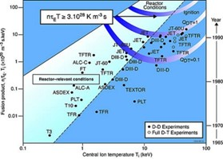

# 劳森(Lawson)判据

## 简介

劳森判据是衡量核聚变的品质参数。用它来比较核聚变反应的能量产出率和能量损耗率。当能量产出率大于能量损耗率，并且有足够的能量被系统捕获和利用，则称之为点火成功。劳森判据的概念最早由John.
D.
Lawson于1955年提出，并于1957年正式发表。劳森判据最初的形式给出了实现净能量增益的最小的等离子体密度$n_{e}$与能量约束时间$\tau_{E}$的乘积。后来的分析表明，更有用的判据形式为三重积：等离子体密度、约束时间、温度的乘积。劳森判据往往指的是三重积要高于某阈值。

## 能量平衡

劳森判据的实质是考查任何使用高温等离子体的聚变反应堆的能量平衡：

$$净功率 = 效率 \times \lbrack 聚变功率 - 辐射损耗功率 - 传导损耗功率\rbrack$$

- 净功率是任何聚变反应能够自持的必要条件。

- 效率指的是聚变装置需要的能量输入以及对聚变反应能量收集的能力。

- 聚变功率是聚变反应的能量产生率。

- 辐射损耗功率是指聚变反应中等离子体通过释放X射线等辐射造成的能量损耗率。

- 传导损耗功率是指由于粒子逃离等离子体而带走的能量损耗率。

Lawson计算聚变功率时假定聚变装置里的等离子体粒子能量具有高斯分布，温度具有麦克斯韦-玻尔兹曼分布。基于此，他算出聚变功率为

$$聚变功率 = 燃料A密度 \times 燃料B密度 \times 反应截面（温度） \times 单位反应能量$$

这个方程是对所有粒子的平均，并假设了离子能量具有高斯分布。但是Lawson认为传导损耗是可以忽略的（实际上是不可以忽略的，粒子数目的损耗会造成系统能量的损失），他得到如下的辐射损耗公式

$$P_{B} = 1.4 \times 10^{- 34} \cdot N^{2} \cdot T^{\frac{1}{2}}\ \lbrack W/cm^{3}\rbrack$$

- 其中$N$为等离子体密度，$T$为等离子体温度

通过平衡聚变功率和辐射损耗功率，可估算出氘氚反应的最低温度为3千万度（$2.6keV$），氘氘反应的最低温度为1.5亿度（$12.9keV$）。

氘氚反应和氘氘反应如下：

$$_{1}^{2}D +_{1}^{3}T \rightarrow_{2}^{4}{He(3.5MeV) +_{0}^{1}{n(14.1MeV)}}$$

$$_{1}^{2}D +_{1}^{2}D \rightarrow_{1}^{3}{T(1.0MeV) +_{0}^{1}{p(3.0MeV)}}$$

## 延伸到$\mathbf{n}\mathbf{\tau}_{\mathbf{E}}$

$\tau_{E}$为约束时间，表征的是系统向其周围环境损耗能量的速率，表示为能量密度$W$与损耗功率$P_{loss}$的比值：

$$\tau_{E} = \frac{W}{P_{loss}}$$

聚变反应堆若要维持稳态运行，聚变等离子体要有稳定的温度。因此系统要有热能输入，热能来源可以为聚变反应的产能，也可以是将部分聚变产能转化的电能重新输入。热能输入率应至少为聚变等离子体的能量损耗率。

下面以氘氚反应来具体阐述。其他反应形式同理。我们假定等离子体中不同粒子种类具有相同的温度，氘氚等比例混合。这样离子密度与电子密度相等。电子和离子的能量密度之和则为：

$$W = 3nk_{B}T$$

- 其中$k_{B}$为玻尔兹曼常数

聚变反应率（单位体积单位时间内的反应数）为：

$$f = n_{d}n_{t}\langle\sigma v\rangle = \frac{1}{4}n^{2}\langle\sigma v\rangle$$

- 其中$\sigma$为反应截面，$v$为相对速度，$\langle\ \rangle$表示平均。

聚变加热率为聚变反应率$f$乘以聚变产生的带电粒子的能量$E_{ch}$（中子不带电，不对加热做贡献）。氘氚反应中

$$E_{ch} = 3.5MeV$$

劳森判据要求聚变加热率大于能量损失率：

$$fE_{ch} \geq P_{loss}$$

把上面的具体表达式带入，即为：

$$\frac{1}{4} n^2 \langle \sigma v \rangle \geq \frac{3 n k_B T}{\tau_E}$$

移项得：

$$n\tau_{E} \geq \frac{12}{E_{ch}}\ \frac{k_{B}T}{\left\langle \sigma v \right\rangle}$$

上式只有$\ \frac{T}{\left\langle \sigma v \right\rangle}$未知，这个量是关于温度的函数。其最低值决定了$n\tau_{E}$的最小值，这便是劳森判据。

对于氘氚反应：

$$n\tau_{E} \geq 1.5 \times 10^{20}\lbrack s/m^{2}\rbrack$$

对应的最低温度为$T = 26keV$

## 延伸三重积

更有用的劳森判据形式为：三重积，密度、温度、约束时间的乘积$n \cdot T \cdot \tau_{E}$

对于大多数的聚变方案，不管是惯性约束，还是磁约束等，等离子体密度和温度都能在较大的范围内改变，但能够达到的最高压强是个常数。聚变功率密度正比于$$ \frac{p^2 \langle \sigma v \rangle}{T^2} $$

将
$$n\tau_{E} \geq \frac{12}{E_{ch}}\ \frac{k_{B}T}{\left\langle \sigma v \right\rangle}$$ 两边乘以温度$T$，我们可以得到

$$nT\tau_{E} \geq \frac{12}{E_{ch}}\ \frac{k_{B}T^{2}}{\left\langle \sigma v \right\rangle}$$

上式右边的位置量依然是温度的函数。对于氘氚反应，对应的最低温度为$\ T = 14\ keV$
。这个温度下对应的$\left\langle \sigma v \right\rangle$为：

$$\left\langle \sigma v \right\rangle = 1.1 \times 10^{- 24}T^{2}\lbrack m^{3}/s\rbrack$$

因而，这个温度下的最小三重积为：

$$nT\tau_{E} \geq 3 \times 10^{21}\lbrack keV \cdot s/m^{3}\rbrack$$

图1 三种聚变反应的三重积

目前，任何聚变装置都还没有达到这个数值。如下图。

图2 不同反应堆的$\ nT\tau_{E}$

一些设备已经很接近了，比如JT-60U报道了三重积$1.53 \times 10^{21}keV \cdot s/m^{3}$。TFTR装置已经实现劳森判据要求的最低密度和约束时间，但是不能同时产生足够高的等离子体温度。ITER的目标是同时实现这三个参数。

对于托克马克装置，还有一个使用三重积的特殊动机。经验地，人们发现约束时间$\tau_{E}$几乎正比于$\frac{n^{\frac{1}{3}}}{P^{\frac{2}{3}}}$。对于优化温度下的点火等离子体，热功率等于聚变功率，因此正比于
$n^{2}T^{2}$ 。所以三重积满足：

$$nT\tau_{E} \propto nT\frac{n^{\frac{1}{3}}}{P^{\frac{2}{3}}} = nT\frac{n^{\frac{1}{3}}}{{{(n}^{2}T^{2})}^{\frac{2}{3}}}$$

$$nT\tau_{E} \propto T^{- \frac{1}{3}}$$

因此，三重积只是微弱的依赖于温度 $T^{- \frac{1}{3}}$ 。

## 惯性约束

劳森判据适用于惯性约束和磁约束。但是对于惯性约束系统，通常可以更方便的表示为另一种形式。对于约束时间的一个很好的近似为粒子以其热速度传播一个距离$R$所用的时间。

离子热速度为：

$$v_{th} \approx \sqrt{\frac{k_{B}T}{m_{i}}}$$

由此约束时间可近似为：

$$\tau_{E} \approx \frac{R}{v_{th}} = \frac{R}{\sqrt{\frac{k_{B}T}{m_{i}}}} = R \cdot \sqrt{\frac{m_{i}}{k_{B}T}}$$

把上式带入$n\tau_{E} \geq \frac{12}{E_{ch}}\ \frac{k_{B}T}{\left\langle \sigma v \right\rangle}$，可得

$$n\tau_{E} \approx n \cdot R \cdot \sqrt{\frac{m_{i}}{k_{B}T}} \geq \frac{12}{E_{ch}}\ \frac{k_{B}T}{\left\langle \sigma v \right\rangle}$$

$$n \cdot R \geq \frac{12}{E_{ch}}\ \frac{{{k}_{B}{T}}^{\frac{3}{2}}}{\left\langle \sigma v \right\rangle m_{i}^{\frac{1}{2}}}  $$

这个乘积必须要大于某一个跟$\frac{T^{\frac{3}{2}}}{\left\langle \sigma v \right\rangle}$相关的数值。通常用质量密度来表示：

$$\rho \cdot R \geq 1g/cm^{2}$$

对于密度为 $0.2g/cm^{3}$的氘氚燃料，上面表达式的满足需要激光具有难以置信的能量。假设所需的激光能量正比于聚变等离子体的质量
$$E_{laser} \sim \rho R^{3} \sim \rho^{- 2}$$ 对氘氚靶丸压缩到1千到1万倍固体密度能够将需要的激光能量降低1百万到1亿倍，从而变得实际。若压缩1千倍，压缩后的密度为$200g/cm^{3}$，靶丸的半径可以小到仅有50微米。压缩前的靶丸半径大概为0.5mm。而初始的靶丸小球还应为至少两倍大，因为压缩时的烧蚀过程会造成很大的质量损失。

对于磁约束聚变，聚变功率密度是一个很好的衡量优化温度的指标，但对于惯性约束聚变烧蚀比率或许是一个更有用的指标。烧蚀比率（$\eta$）正比于聚变反应率（$n^{2}\left\langle \sigma v \right\rangle$）乘以约束时间（$\sim T^{\frac{1}{2}}$）除以粒子数密度（$n$）：

$$\eta \propto \frac{n^{2}\left\langle \sigma v \right\rangle T^{\frac{1}{2}}}{n} = \frac{nT\left\langle \sigma v \right\rangle}{T^{\frac{3}{2}}}$$

这样，惯性聚变的最优化温度要最大化$$ $$，稍微比磁约束的最优化温度高一些。

## 非热力系统

Lawson的分析基于热化等离子体中的聚变速率和能量损失。有一类聚变机不使用热化等离子体，而是直接将单个离子加速到所需的能量。最著名的例子是migma、fusor和polywell。

当应用于融合器时，Lawson的分析被用作传导和辐射损耗是达到净功率的主要障碍的论据。聚变器使用电压降来加速和碰撞离子，从而导致聚变。电压降由金属丝笼产生，这些笼子将颗粒带走。

Polywells是对这种设计的改进，旨在通过移除导致传导损耗的线笼来减少传导损耗。无论如何，有人认为辐射仍然是一个主要障碍。

## 参考资料

1. Lawson, J. D. (December 1955). Some criteria for a useful
thermonuclear reactor (PDF) (Technical report). Atomic Energy Research Establishment, Harwell, Berkshire, U. K.

2. (https://zhuanlan.zhihu.com/p/138364870#ref_2_0) Lawson, J. D.
(December 1955). \"Some Criteria for a Power Producing Thermonuclear Reactor\". Proceedings of the Physical Society, Section B. 70 (1): 6-10.  <https://iopscience.iop.org/article/10.1088/0370-1301/70/1/303>

3. Lyman J Spitzer, \"The Physics of Fully Ionized Gases\" 1963

4. J. Wesson, \"Tokamaks\", Oxford Engineering Science Series No 48,Clarendon Press, Oxford, 2nd edition, 1997.

5. World Highest Fusion Triple Product Marked in High-βp H-mode
Plasmas Archived 2013-01-06 at the Wayback
Machine <https://web.archive.org/web/20130106002319/http://www.jt60.naka.jaea.go.jp/english/html/exp_rep/rep36.html>

6. Lawson criterion at <https://en.wikipedia.org/wiki/Lawson_criterion>
