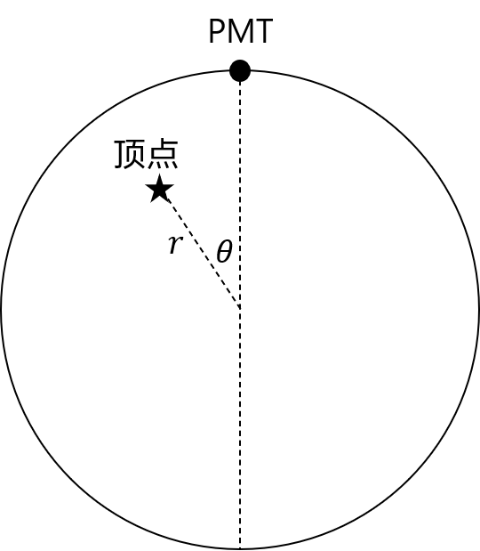
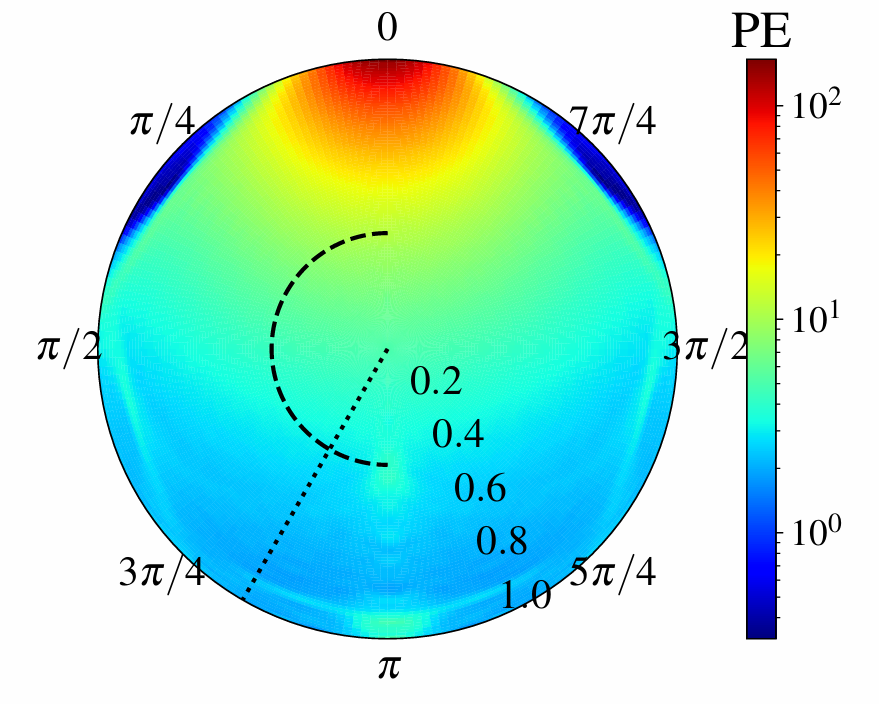

# JUNO 模拟与分析软件包

人类最难能可贵的智慧，就是对于未知的领域保有充分的好奇心。他们会穷尽一切手段，使用各种超出一般人认知的方法满足它。例如，在粒子物理领域，中微子的许多性质尚未确定。由于中微子只参与弱相互作用，以 [IBD](https://en.wikipedia.org/wiki/Inverse_beta_decay) 为例：
$$
\bar{\nu}_e+p\to e^+ +n
$$
其反应截面要比铀裂变低20个数量级。因此，妄图像化学家那样在烧杯中观察中微子是不现实的。

计算机科学的发展给了我们进一步开展中微子实验的底气。只要我们准备的质子足够多，总能观察到中微子的 IBD 反应。于是，一个个大坑相继出现。这之中较早的是[超级神冈](https://en.wikipedia.org/wiki/Super-Kamiokande)，虽然它一开始是设计用来观测质子衰变的，但是这个圆柱形的大坑很快成为了中微子实验的优质场地。而我们今天要讨论的探测器，是在建的[江门地下中微子实验（JUNO）](https://en.wikipedia.org/wiki/Jiangmen_Underground_Neutrino_Observatory)。其球对称的构造更是为数据处理带来了方便。

反应容器的增大带来的是探测器的数量的急剧增加。如果我们的反应容器只有一升，可能只需要一两个光电倍增管（PMT）；而如果反应容器有一百万升，两个 PMT 显然不够。还好，我们的课程是**大数据**分析，其核心思想就在于，两个和 114514 个的区别只在于数量。只要我们能够搞定一个，就能搞定 17612 个。

## 物理过程

这一节看不懂**会影响**后面作业的完成。其中有一些公式，可以选择使用较新版本的 VS Code 预览，或者查看 PDF 版本。

在 JUNO 探测器中，最里面是一个装满了液体闪烁体（液闪，liquid scintillator, LS）的大球，液闪球的半径17.71m，粒子在这之中会发光；外面是一层水球包裹，水球外面有许多 PMT。这些 PMT 到球心的距离均为19.5m。液闪是一种特殊的有机物，在正负电子的激发下会发生能级跃迁，各向同性地发出光子，被 PMT 探测到。这些发光的点被称作顶点。

通常来说，MeV 量级的电子可以近似看作一个顶点，它们会迅速在某个位置耗尽所有动能。MeV 量级的正电子可以近似看作一个电子与两个方向相反的 $\gamma$。$\gamma$ 能量较高，与许多电子发生康普顿散射，可以看作一群顶点。

顶点的动能不会完全转化为发光光子的总能量（也称为可见能量）。这之间的转化满足 [Birks 定律](https://en.wikipedia.org/wiki/Birks%27_law)：
$$
\frac{dL}{dx}=S\frac{\frac{dE}{dx}}{1+kB\frac{dE}{dx}}
$$
其中 $L$ 为光子数，$x$ 为距离，$S$ 为光产额，$kB$ 为 Birks 常数，$\frac{dE}{dx}$ 为电离能损。

光子进入 PMT，在光阴极上发生光电效应，打出光电子（PE）。PE 在 PMT 内经历放大过程，最终电子打到阳极上，生成波形信号。

## 第一阶段（前两周课程）作业要求

这一阶段的工作是正向的**模拟**。为了响应教育部给大学增负的号召，我把基础要求定得低一些，并提供额外的加分项。我们强烈建议各位同学仔细考虑这些加分项的性价比，不要为了一两分影响暑假的美好心情。

考虑到各位同学是初次学习 Python，我们今年决定将基础要求定为模拟**一个** PMT 上的 PE。模拟全部 17612 个 PMT 上的 PE是加分项，欢迎有余力的同学挑战。值得补充的是，2021 年的几乎所有选择了这门作业的同学都成功写出了能在 24 小时内模拟 4000 个顶点在 17612 个 PMT 上产生的响应的代码。

### 基础要求：模拟 (40')

给定 JUNO 探测器几何，随机生成4000个顶点，并对于每个顶点，给出至少1个 PMT 上激发得到的 PE 的击中时间（hit time）。注意，并不一定所有 PMT 都会被击中。击中时间的时间零点取为顶点的时间，或者说，需要记录的是击中时间与顶点时间的时间差。

顶点对位置分布与动量分布有要求（20'）。要求顶点在探测器内的**数体积密度均匀**。

要求顶点的动量为 1 MeV，考虑到 Birks 定律不是考察重点，可以认为每个顶点产生约 10000 个光子。这些光子实际上经过[非齐次泊松过程](https://en.wikipedia.org/wiki/Poisson_point_process)采样得到，这个泊松过程的期望可以认为
$$
t_l\propto \exp{\left(-\frac{t}{\tau_d}\right)}\left(1-\exp{\left(-\frac{t}{\tau_r}\right)}\right)
$$
其中 $\tau_d$ 与 $\tau_r$ 为两个待定常数，你可以分别取 10ns 和 5ns。这是一个双指数函数。应当注意到这个函数在 $[0,\infty)$ 上的积分应为 10000，请自行计算归一化系数。这些光子的发射方向应当是**随机**的。

光子击中 PMT 后，有一定概率引发光电效应。为了简便起见，我们认为完全会引发光电效应，并一定产生一个 PE。

为了检验这些结果（20'），需要通过编写画图的程序。具体的要求见下文。

请注意，一个正常的图像应当有坐标轴标签和标题。如果有多种颜色，应当有图例。我们会根据生成的模拟数据画图，并和你的画图程序输出比较。

### 基础要求：光学过程 (40')

在实现探测器的响应的时候，最简单的方法是根据平方反比计算（10'）。也就是说，PMT 上接受到的光子数期望应当和$\frac{1}{r^2}$成正比，$r$是 PMT 到顶点的距离。可以认为 PMT 是一个直径 50.8cm 的球体，我们的几何文件给出了 PMT 球心位置的球坐标角度部分。

然而，实际情况中，我们可能需要考虑在水和液闪界面一次反射的情况。考虑到一次反射，可能出现的情况主要有全反射（10'）和折射（10'）。你可以取水的折射率为 1.33，液闪的折射率为 1.48。液闪发光的偏振特性与自然光相同。对于光学过程的考察，不要求实现细节，但是要求给出 PMT 对于顶点的响应分布。

这个分布我们一般称为 Probe 函数（实际上是忽略了时间和能量的 Probe）。它表示一个 PMT 对探测器内任意一点的顶点的接收的光子产生的 PE 数期望。我们可以近似认为这上万个 PMT 除了位置不同，其它性质完全相同，因而这个函数只需要考虑顶点与 PMT 的相对位置 $(r,\theta)$，其中 $r\in[0,1]$ 为顶点距离球心的位置，$\theta\in[0,\pi]$ 为顶点与 PMT 相对球心的夹角。对于 Probe 函数 $R(r,\theta)$，你应该给出一个圆盘图像（10'）。

| 相对位置示意图              |
| --------------------------- |
|  |

| Probe 示意图               |
| -------------------------- |
|  |

一个小提示：Probe 函数的图像与你是否考虑反射无关，仅与模拟输出数据有关。因此即使你不考虑反射，也能拿这画图的10分。

注意，你得到的图像不需要和示例图像完全一致，也**不是**越像越好。在你的实验报告中，要给出你对于你所得到的 Probe 图像中的结构的解释。例如，示例图像在 $45^\circ$ 和 $315^\circ$ 附近的深色区域标志着此处的顶点发光因为全反射无法到达顶部的 PMT。

Probe 图像可以辅助你观察模拟代码是否正确。例如，远离 PMT 的一端不应该有大量的顶点。

### 基础要求：非功能部分 (20')

此部分详见大作业公告。

### 基础要求：代码 (*)

代码应该符合下面的要求、能够运行，且能够在合理时间内（如：提交成绩前）停止（注意！时间超过24小时会根据心情扣分）。不满足该条件作业**记0分**。如果到最后你也不能写出在24小时完整模拟4000个顶点的代码，可以减少模拟的顶点数量，以确保助教能够验证后续部分的正确性。

#### `Makefile`

考虑到大家可能还没有学过 Makefile，这次我提供了基础模板。最终我们将使用 Makefile 测试，因此你**不应该**更改其内容。

关于 Makefile 的使用，下面列出你需要的命令：

```bash
$ make data.h5 # 生成 data.h5
$ make figures.pdf # 生成 figures.pdf
$ make all # 与 `make figures.pdf` 相同
$ make clean # 删除上述两个文件
```

#### `simulate.py`

这是模拟程序文件。我提供了一个基础的模板，处理了命令行参数。里面给出了基础的程序框架，但是你可以随意修改。尤其 `for` 循环是很慢的，如果你擅长使用 `numpy`，也许能矢量化处理。

为了显示模拟的进度，基础模板里使用了 `tqdm` 包显示进度条。如果你使用 Debian/Ubuntu，可能需要预先安装：
``` bash
$ sudo apt install python3-tqdm
```

模拟输出文件为 `data.h5`，该文件名在命令行中指定。其格式为：

`ParticleTruth` 表

| 名称      | 说明         | 类型    |
| --------- | ------------ | ------- |
| `EventID` | 事件编号     | `'<i4'` |
| `x`       | 顶点坐标x/mm | `'<f8'` |
| `y`       | 顶点坐标y/mm | `'<f8'` |
| `z`       | 顶点坐标z/mm | `'<f8'` |
| `p`       | 顶点动量/MeV | `'<f8'` |

`PETruth` 表

| 名称        | 说明           | 类型    |
| ----------- | -------------- | ------- |
| `EventID`   | 事件编号       | `'<i4'` |
| `ChannelID` | PMT 编号       | `'<i4'` |
| `PETime`    | PE 击中时间/ns | `'<f8'` |

注意，在输出 HDF5 文件的时候，请分清 group, dataset, column 的区别。下面给出典型的错误代码和应该使用的正确示例：

``` python
# 错误代码——会创建一系列 group
opt["ParticleTruth"]["EventID"] = event_id
opt["ParticleTruth"]["x"] = x
opt["PETruth"]["EventID"] = event_id_pe

# 正确代码——创建 dataset
truth = opt.create_dataset("ParticleTruth", (4000,), 
                           dtype=[("EventID", "<i4"),
                                  ("x", "<f8"), 
                                  ("y", "<f8"), 
                                  ("z", "<f8"), 
                                  ("p", "<f8")])
truth["EventID"] = event_id
truth["x"] = x
pe_truth = opt.create_dataset("PETruth", 
                              (pe_count,), 
                              dtype=[("EventID", "<i4"), 
                                     ("ChannelID", "<i4"), 
                                     ("PETime", "<f8")])
pe_truth["EventID"] = event_id_pe

# 正确代码——使用结构化数组
truth_arr = np.zeros(4000, 
                     dtype=[("EventID", "<i4"), 
                            ("x", "<f8"), 
                            ("y", "<f8"),
                            ("z", "<f8"), 
                            ("p", "<f8")])
truth_arr["EventID"] = event_id
truth_arr["x"] = x
opt.create_dataset("ParticleTruth", data=truth_arr)
```

#### `draw.py`

这是画图程序文件。提供了一个比较详细的模板，理论上你只需要修改 `Drawer` 类里面的几个函数（现在函数体是 `print("TODO: xxx")`，实现了相应的功能之后请至少把 `TODO:` 删掉）就可以完成任务。但是为了修改这几个函数你需要完整读一读这个文件，如果读不懂可以问助教。

`Drawer` 这个类在测试的时候用到，因此你**不应该**修改它的函数签名。如果修改了，助教可能会尝试还原；如果无法还原，或者你不在 `Drawer` 里面实现画图功能，助教会很生气，并且扣很多分。

画图输出文件为 `figures.pdf`，该文件名在命令行中指定。每页一张图像，一共包括：

* 顶点的数体积密度关于半径的图像
* PE 的击中时间的直方图
* Probe 的圆盘函数图像（极坐标）

你可以通过检查这些图像来验证自己的模拟正确性。

#### `geo.h5`

几何文件，其格式为：

`Geometry` 表

| 名称        | 说明                     | 类型    |
| ----------- | ------------------------ | ------- |
| `ChannelID` | PMT 编号                 | `'<u4'` |
| `theta`     | 球坐标 $\theta$ **角度** | `'<f4'` |
| `phi`       | 球坐标 $\phi$ **角度**   | `'<f4'` |

你可能会注意到，几何文件提供的 PMT 个数远大于我的要求。~~这是因为我懒得删了。~~

#### 实验报告

实验报告。在完成这个作业之前，建议先看看已经准备好的实验报告模板（`report.md`），那里有一些温馨提示。你也可以选择使用 LaTeX 书写报告，但请在仓库中同时附上编译后的 PDF 文件，以便查阅。

### 加分项目

注意：无论你完成了多少加分项，最终**至多可加 10 分**。

### 完整的模拟（5'）

完整模拟17612个 PMT 可能的响应。如果一个事件中某个 PMT 没有得到光子，那么它不会触发，也就不会产生波形。

### 正电子 (5')

讨论正电子在液闪内可能的物理过程，尤其注意 $\gamma$ 会在液闪中随机与电子发生康普顿散射。从数体密度均匀的正电子源开始模拟。不要求顶点的数体密度。实验报告中的顶点密度图像应换成正电子密度图像，并注明。

### 线源（5'）

这回我们不考虑一个顶点作为光源，而是一条线段，比如 $\mu$ 子。为了考虑一条线段源在探测器中的响应，你可能需要6个参数：$r,\theta,r',\theta',\phi,t$。这里的五个位置坐标标注了线段的端点相对于 PMT 的位置，以及一个旋转角。同时，你需要考虑这个线源是一个高速运动的粒子，因此它会产生切伦科夫光。

这一项目不作具体实现要求，请自行探索合理的表现手法，并在报告中写明。

### 进阶光学（5'）

考虑到 PMT 的表面是玻璃，可能反射一些光子。因此你应该在模拟时考虑一定概率的反射。我们的基础要求画的图可能不会反映出这一光学过程。你应该考虑一些更明确的表现方式。
