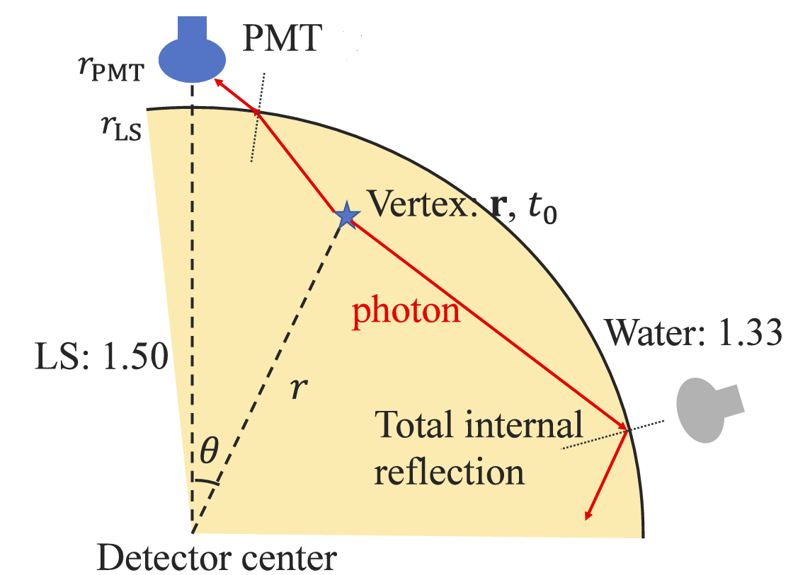
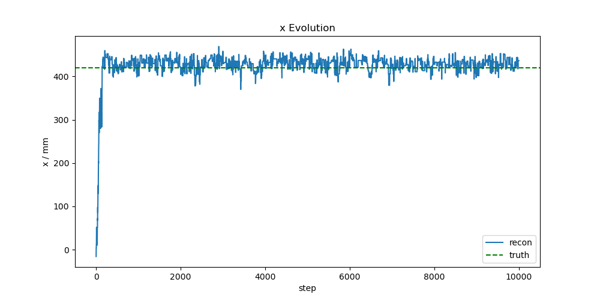

# MCMC (附加选做作业)

## 问题背景



闪烁体是指和辐射相互作用之后能产生闪烁光子的物质。液闪探测器是利用电离辐射在液体闪烁体中产生闪光来探测电离辐射的探测器。液闪探测器中顶点发光后，光子会传播到各个光电倍增管 PMT，PMT 会将光信号转为电信号记录下来。建立探测器的光学响应模型 probe，给定顶点的能量 $E$、位置 $\bm{r}$、时间 $t_0$，probe 给出的 $t$ 时刻，编号为 $j$ 的 PMT 上接收到光电子期望数密度为

$R_j(t;\mathcal{V}) = E \lambda_j(\bm{r})\phi_j(t - t_0;\bm{r})$

$\phi_j$ 为归一化光变曲线，$\lambda_j(\bm{r})$ 则为光强。记 $\mathcal{V} = (E,\bm{r},t_0)$，根据光电子接收时间 $t_{jk}$ 和 probe 进行马尔科夫链蒙特卡洛 MCMC 采样，得到顶点的后验分布。MCMC 是一种基于随机抽样和马尔可夫链的统计方法，该方法主要利用了马尔科夫链的平稳分布特性，同时用拒绝-接收的采样方法规避直接获得马尔可夫转移矩阵的困难。其中常用的 MCMC 算法有 Metropolis-Hastings 算法 (MH 算法)。

用 $n_j$ 表示 $j$ 通道上光电子书，用 $k$ 表示某通道上光电子的序号，似然函数为

$\mathscr{L}(\mathcal{V} | \{t_{jk}\}) = \prod_j p(\{t_{jk}\} | \mathcal{V}) = \prod_j \overbrace{\prod_{k=1}^{n_j} \phi_j(t_{jk} - t_0; \bm{r})}^{\mathrm{timing\ part}} \cdot \overbrace{ e^{-E\lambda_j} (E\lambda_j)^{n_j}}^{\mathrm{PE\ part}}$

MH 采样的接收率为

$a = \min\left\{1,\frac{\mathscr{L}(\mathcal{V'} | \{t_{jk}\})}{\mathscr{L}(\mathcal{V} | \{t_{jk}\})}\right\}$

为了提高采样效率，进行 $E,\bm{r},t_0$ 分开采样的 gibbs 方案。

采样结果如下所示，横轴为采样步数，纵轴为位置的 $x$ 分量，蓝色实线为采样结果，绿色虚线为模拟真值。



## 问题描述

仓库中现有代码实现了 MCMC 采样的基本操作，但由于大量使用了 for 循环，导致程序耗时较长，现需要对其进行加速，基本思路如 batch 化，使得多事例、多通道的计算可以同步进行等。

- `Makefile` 实现了生成文件的依赖关系，**请不要修改**
- `check.py` 用于检验代码更改后结果的正确性，**请不要修改**
- `config.py` 定义了采样相关参数，**请不要修改**
- `main.py` 实现了前置文件的读入，**请不要修改**
- `accept.py` 实现了似然函数的计算，是采样接收的判据，可修改以提速
- `mcmc.py` 实现了能量、位置、时间的采样，可修改以提速
- `requirements.txt` 展示了助教测试时的版本。

## 样例与评分

提供两个数据集，事例数分别为 10 个 `data/Entries10.root`，100 个 `data/Entries100.root`。最终评测只以 `data/Entries100.root` 数据集为准。`data/example.h5` 为 `data/Entries10.root` 的采样结果示例，`mcmc.py` 使用了 tables 保存数据，若安装不便可以在保证输出 hdf5 格式不变的情况下，任意替换并无影响，参考 `data/example.h5` 的格式

关于 Makefile
```
$ make all # 执行 MCMC 采样 100 个事例数据集
$ make data/tvE10.h5 # 执行 MCMC 采样 10 个事例数据集的测试
$ make clean # 清除 MCMC 采样结果
$ make check # 评测：检验代码更改后结果的正确性及计时 （若未进行修改预计耗时 3.5h）
```

本作业为课堂附加作业，因此评分较为严格。改进代码导致采样结果错误、代码风格较差、Git 使用有严重错误，或者存在学术诚信问题，会直接导致 0 分

附加作业将提供总评 0 - 8 分的额外加分，具体方案视参与人数和代码运行用时 (需在采样结果保持正确的前提下) 排名决定

杜绝抄袭！！！

