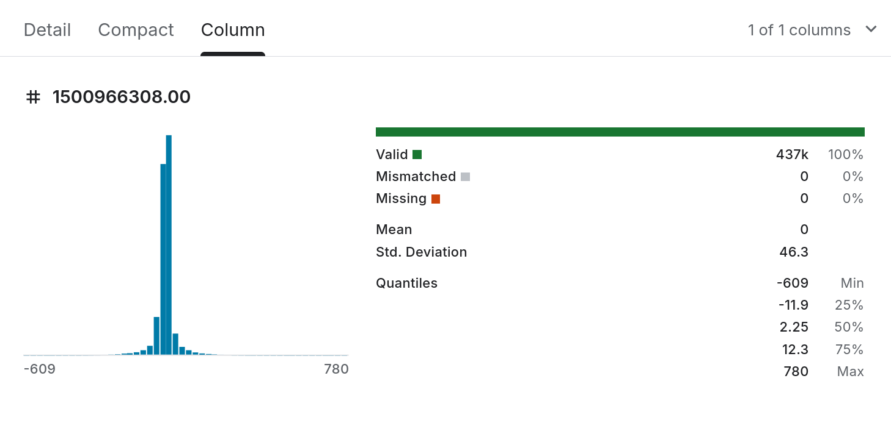

Hearing that I will get bonus points if I use GitHub to submit my homework, so you may find my homework in this link: [https://github.com/SphenHe/BypassTsinghua/tree/master/40880033/](https://github.com/SphenHe/BypassTsinghua/tree/master/40880033/)

## Problem 1: Identify data structures in biostatistics

- (a): cross-sectional data
  - (i) the unit: An individual patient
  - (ii) at least two (possible) covariates: Blood pressure & low-density lipoprotein
  - (iii) the time dimension: Measured at a single point in time (2025)
- (b): longitudinal data
  - (i) the unit: An individual patient
  - (ii) at least two (possible) covariates: Time(week) & pain score
  - (iii) the time dimension: Week 1, 2, 4, 8
- (c): time-to-event data
  - (i) the unit: An individual patient
  - (ii) at least two (possible) covariates: Vaccine usage & survival rate
  - (iii) the time dimension: Time to event (time until death or disease occurrence)

## Problem 2: Wearable device data

(a)(b)

| Compare | wearable dataset | traditional study |
| :---| :--- | :--- |
| measurement frequency | Every minute for 7 consecutive days | Once per month for 6 months |
| dependence structure | Strong serial correlation and temporal correlation | Autocorrelation at the minute level is not taken into account
| statistical modeling challenges | Huge data size and complexity | Lack of data |

(c) For Kaggle:

- Dataset reference: [https://www.kaggle.com/datasets/orvile/wesad-wearable-stress-affect-detection-dataset](https://www.kaggle.com/datasets/orvile/wesad-wearable-stress-affect-detection-dataset)
- Dataset description:
  - Affect recognition aims to detect a person's affective state based on observables, with the goal to e.g. improve human-computer interaction. Long-term stress is known to have severe implications on wellbeing, which call for continuous and automated stress monitoring systems. However, the affective computing community lacks commonly used standard datasets for wearable stress detection which a) provide multimodal high-quality data, and b) include multiple affective states.
  - Therefore, we introduce WESAD, a new publicly available dataset for wearable stress and affect detection. This multimodal dataset features physiological and motion data, recorded from both a wrist- and a chest-worn device, of 15 subjects during a lab study. The following sensor modalities are included: blood volume pulse, electrocardiogram, electrodermal activity, electromyogram, respiration, body temperature, and three-axis acceleration. Moreover, the dataset bridges the gap between previous lab studies on stress and emotions, by containing three different affective states (neutral, stress, amusement). In addition, self-reports of the subjects, which were obtained using several established questionnaires, are contained in the dataset.
    - For data from RespiBAN, all signals were sampled at 700 Hz. Raw data is contained in SX_respiban.txt.
    - For data from Empatica E4,
      - ACC.csv: sampled at 32 Hz. The 3 data columns refer to the 3 accelerometer channels. Data is provided in units of 1/64g.
      - BVP.csv: sampled at 64 Hz. Data from photoplethysmograph (PPG).
      - EDA.csv: sampled at 4 Hz. Data is provided in μS.
      - TEMP.csv: sampled at 4 Hz. Data is provided in °C.
    - For synchronised data, ‘label’: ID of the respective study protocol condition, sampled at 700 Hz
- Data demo: the data are stored in different csv files so I can only show them seperately. Here I choose BVP.csv (Data from photoplethysmograph).

There is only one column of in the csv file, showing the photoplethysmograph data. and time data is contained in the rows number.

## Problem 3: Longitudinal versus repeated measurements

- SUBJECT A
  - (i): 1 time points
  - (ii): No, these three observations are aiming for reducing the equipment errors but not to track how data changes during the time.
  - (iii): We cannot analyse data vs time changes.
- SUBJECT B
  - (i): 3 time points
  - (ii): No, they have time connections and these data come from the same Subject B
  - (iii): We need to figure out the if data change come from time change or Subject B's change (maybe we can use ANOVA?)

## Problem 4: Survival data and censoring

- (a): It means patient 3 was observed in 3 months and indicates relapse didn't occur, and cannot be observed after 3 months. So his true relapse time > 3 months.
- (b): Dropping all censored patients means dropping data that has longer indicates relapse time, which leads to lower indicates relapse time, causing selection bias.

## Problem 5: Bias, variance, and MSE

Let
$$
\hat{\mu}_1=\frac{1}{n}\sum_{i=1}^n X_i, \qquad 
\hat{\mu}_2=\frac{1}{n}\sum_{i=1}^n X_i + c,
$$
where $c$ is a constant.

(a) Compute $\mathrm{Bias}(\hat{\mu}_1)$ and $\mathrm{Bias}(\hat{\mu}_2)$

By definition,
$$
\mathrm{Bias}(\hat{\mu}) = \mathbb{E}[\hat{\mu}] - \mu.
$$

For $\hat{\mu}_1$,
$$
\mathbb{E}[\hat{\mu}_1]
= \mathbb{E}\left[\frac{1}{n}\sum_{i=1}^n X_i\right]
= \frac{1}{n}\sum_{i=1}^n \mathbb{E}[X_i]
= \frac{1}{n}\cdot n\mu
= \mu.
$$
So,
$$
\mathrm{Bias}(\hat{\mu}_1)=\mu-\mu=0.
$$

For $\hat{\mu}_2$,
$$
\mathbb{E}[\hat{\mu}_2]
= \mathbb{E}\left[\frac{1}{n}\sum_{i=1}^n X_i + c\right]
= \mu + c.
$$
So,
$$
\mathrm{Bias}(\hat{\mu}_2)
= (\mu+c)-\mu
= c.
$$

Therefore,
$$
\mathrm{Bias}(\hat{\mu}_1)=0, \qquad \mathrm{Bias}(\hat{\mu}_2)=c.
$$

(b) Compute $\mathrm{var}(\hat{\mu}_1)$ and $\mathrm{var}(\hat{\mu}_2)$

Since $X_1,\dots,X_n$ are i.i.d. with $\mathrm{var}(X_i)=\sigma^2$,
$$
\mathrm{var}\left(\hat{\mu}_1\right)
= \mathrm{var}\left(\frac{1}{n}\sum_{i=1}^n X_i\right)
= \frac{1}{n^2}\sum_{i=1}^n \mathrm{var}(X_i)
= \frac{1}{n^2}\cdot n\sigma^2
= \frac{\sigma^2}{n}.
$$

For $\hat{\mu}_2 = \hat{\mu}_1 + c$, adding a constant does not change the variance, so
$$
\mathrm{var}(\hat{\mu}_2)=\mathrm{var}(\hat{\mu}_1)=\frac{\sigma^2}{n}.
$$

Therefore,
$$
\mathrm{var}(\hat{\mu}_1)=\frac{\sigma^2}{n}, \qquad \mathrm{var}(\hat{\mu}_2)=\frac{\sigma^2}{n}.
$$

(c) Write $\mathrm{MSE}(\hat{\mu}_2)$ as a function of $c$, $n$, and $\sigma^2$

Recall that
$$
\mathrm{MSE}(\hat{\mu}) = \mathrm{var}(\hat{\mu}) + \mathrm{Bias}(\hat{\mu})^2.
$$

Using the results above,
$$
\mathrm{MSE}(\hat{\mu}_2)
= \frac{\sigma^2}{n} + c^2.
$$

So,
$$
\mathrm{MSE}(\hat{\mu}_2)=\frac{\sigma^2}{n}+c^2.
$$

(d) For fixed $n$ and $\sigma^2$, what value of $c$ minimizes $\mathrm{MSE}(\hat{\mu}_2)$? Interpret the result.

Since
$$
\mathrm{MSE}(\hat{\mu}_2)=\frac{\sigma^2}{n}+c^2,
$$
and $\frac{\sigma^2}{n}$ is constant with respect to $c$, the MSE is minimized when $c^2$ is as small as possible.

The minimum value of $c^2$ is $0$, which occurs at
$$
c=0.
$$

## Problem 6

Assume $X_1,\dots,X_n \sim N(\mu,\sigma^2)$ with known $\sigma^2$.

(a) Derive a $100(1-\alpha)\%$ confidence interval for $\mu$ using a pivot variable.

Since $\bar X \sim N\left(\mu,\frac{\sigma^2}{n}\right)$, the pivot variable is
$$
Z=\frac{\bar X-\mu}{\sigma/\sqrt{n}} \sim N(0,1).
$$

Therefore,
$$
P\left(-z_{\alpha/2} \le \frac{\bar X-\mu}{\sigma/\sqrt{n}} \le z_{\alpha/2}\right)=1-\alpha.
$$

Multiply by $\sigma/\sqrt{n}$:
$$
P\left(-z_{\alpha/2}\frac{\sigma}{\sqrt{n}} \le \bar X-\mu \le z_{\alpha/2}\frac{\sigma}{\sqrt{n}}\right)=1-\alpha.
$$

Rearranging for $\mu$ gives
$$
P\left(\bar X-z_{\alpha/2}\frac{\sigma}{\sqrt{n}} \le \mu \le \bar X+z_{\alpha/2}\frac{\sigma}{\sqrt{n}}\right)=1-\alpha.
$$

So the $100(1-\alpha)\%$ confidence interval is
$$
\left(\bar X-z_{\alpha/2}\frac{\sigma}{\sqrt{n}},\; \bar X+z_{\alpha/2}\frac{\sigma}{\sqrt{n}}\right).
$$

(b) Under the same normality assumption, now suppose $\sigma^2$ is unknown. State a standard $100(1-\alpha)\%$ CI for $\mu$ and the distributional result used.

When $\sigma^2$ is unknown, use
$$
T=\frac{\bar X-\mu}{S/\sqrt{n}} \sim t_{n-1},
$$
where $S$ is the sample standard deviation.

Thus,
$$
P\left(-t_{\alpha/2,n-1} \le \frac{\bar X-\mu}{S/\sqrt{n}} \le t_{\alpha/2,n-1}\right)=1-\alpha.
$$

So the standard $100(1-\alpha)\%$ confidence interval is
$$
\left(\bar X-t_{\alpha/2,n-1}\frac{S}{\sqrt{n}},\; \bar X+t_{\alpha/2,n-1}\frac{S}{\sqrt{n}}\right).
$$

The distributional result used is
$$
\frac{\bar X-\mu}{S/\sqrt{n}} \sim t_{n-1}.
$$

(c) A sample of size $n=25$ has $\bar x=120$ and $s=15$. Compute the $95\%$ CI for $\mu$.

Since $\sigma$ is unknown, use the $t$ interval with $n-1=24$ degrees of freedom. For a $95\%$ confidence interval,
$$
t_{0.025,24} \approx 2.064.
$$

The standard error is
$$
\frac{s}{\sqrt{n}}=\frac{15}{\sqrt{25}}=\frac{15}{5}=3.
$$

So the margin of error is
$$
2.064 \times 3 = 6.192.
$$

Hence the $95\%$ CI is
$$
(120-6.192,\;120+6.192)=(113.808,\;126.192).
$$

Therefore, the $95\%$ confidence interval is approximately
$$
(113.81,\;126.19).
$$

## Problem 7

A researcher tests $H_0:\mu=0$ vs $H_1:\mu\ne 0$ using a two-sided $t$-test and reports a p-value of $0.02$.

(a) Give the interpretation of “p-value = 0.02”.

A p-value of $0.02$ means that, assuming $H_0:\mu=0$ is true, the probability of obtaining a test statistic at least as extreme as the one observed, in the direction of the two-sided alternative, is $0.02$.

Equivalently, if the null hypothesis were true, data this inconsistent with $H_0$ would occur about $2\%$ of the time.

(b) If the researcher had used $\alpha=0.05$, what decision would be made? What if $\alpha=0.01$?

The decision rule is to reject $H_0$ when
$$
\text{p-value} < \alpha.
$$

At $\alpha=0.05$,
$$
0.02 < 0.05,
$$
so we reject $H_0$.

At $\alpha=0.01$,
$$
0.02 > 0.01,
$$
so we do not reject $H_0$.

Therefore:

At $\alpha=0.05$, reject $H_0$.

At $\alpha=0.01$, fail to reject $H_0$.

## Problem 8

Let $U \sim \mathrm{Uniform}(0,1)$.

(a) Define $X=-\log(U)$. Find the CDF and PDF of $X$. Identify the distribution of $X$.

For $x<0$, since $X=-\log(U)\ge 0$, we have
$$
F_X(x)=P(X\le x)=0.
$$

For $x\ge 0$,
$$
F_X(x)=P(-\log(U)\le x).
$$

This is equivalent to
$$
\log(U)\ge -x,
$$
so
$$
U \ge e^{-x}.
$$

Hence,
$$
F_X(x)=P(U\ge e^{-x})=1-e^{-x},
$$
because $U\sim \mathrm{Uniform}(0,1)$.

Therefore,
$$
F_X(x)=
\begin{cases}
0, & x<0,\\
1-e^{-x}, & x\ge 0.
\end{cases}
$$

Differentiate to get the PDF:
$$
f_X(x)=
\begin{cases}
e^{-x}, & x\ge 0,\\
0, & x<0.
\end{cases}
$$

So $X$ has an exponential distribution with rate $1$:
$$
X \sim \mathrm{Exp}(1).
$$

(b) More generally, let $F$ be a continuous CDF that is strictly increasing on its support. Define $Y=F^{-1}(U)$. Show that $Y$ has CDF $F$.

For any $y$ in the support,
$$
P(Y\le y)=P(F^{-1}(U)\le y).
$$

Since $F$ is strictly increasing, applying $F$ preserves the inequality:
$$
P(F^{-1}(U)\le y)=P(U\le F(y)).
$$

Because $U\sim \mathrm{Uniform}(0,1)$,
$$
P(U\le F(y))=F(y).
$$

Therefore,
$$
P(Y\le y)=F(y),
$$
so the CDF of $Y$ is exactly $F$.

Thus $Y=F^{-1}(U)$ has distribution function $F$.

(c) Construct a random variable $Z$ with CDF
$$
F_Z(z)=
\begin{cases}
0, & z<0,\\
z^2, & 0\le z\le 1,\\
1, & z>1.
\end{cases}
$$

Use the inverse transform method. Let $U\sim \mathrm{Uniform}(0,1)$. For $0\le z\le 1$, we have
$$
F_Z(z)=z^2.
$$

Set
$$
u=z^2.
$$
Then
$$
z=\sqrt{u}.
$$

So define
$$
Z=\sqrt{U}.
$$

Check:
$$
P(Z\le z)=P(\sqrt{U}\le z)=P(U\le z^2)=z^2, \qquad 0\le z\le 1.
$$

Thus $Z=\sqrt{U}$ has the required CDF.

## Problem 9

Consider the simple linear regression model with an intercept:
$$
Y_i=\beta_0+\beta_1 x_i+\varepsilon_i, \qquad i=1,\dots,n,
$$
where $x_1,\dots,x_n$ are fixed and not all equal, and $\varepsilon_i$ are i.i.d. with mean $0$ and variance $\sigma^2$. Let $\hat\beta_1$ be the OLS estimate of $\beta_1$ and let
$$
t=\frac{\hat\beta_1}{\mathrm{SE}(\hat\beta_1)}
$$
be the $t$-statistic for testing $H_0:\beta_1=0$. Let $r$ be the sample correlation coefficient. Prove the identity
$$
r^2=\frac{t^2}{t^2+(n-2)}.
$$

In simple linear regression with an intercept, we have the identity
$$
R^2=r^2,
$$
where $R^2$ is the coefficient of determination.

Also, for simple linear regression,
$$
F=\frac{\mathrm{SSR}/1}{\mathrm{SSE}/(n-2)}.
$$

Since there is only one slope parameter, the $F$ statistic is related to the $t$ statistic by
$$
F=t^2.
$$

On the other hand,
$$
R^2=\frac{\mathrm{SSR}}{\mathrm{SST}},
\qquad
1-R^2=\frac{\mathrm{SSE}}{\mathrm{SST}}.
$$

Therefore,
$$
\frac{R^2}{1-R^2}=\frac{\mathrm{SSR}}{\mathrm{SSE}}.
$$

Now write the $F$ statistic as
$$
F=\frac{\mathrm{SSR}/1}{\mathrm{SSE}/(n-2)}
=\frac{\mathrm{SSR}}{\mathrm{SSE}}(n-2)
=\frac{R^2}{1-R^2}(n-2).
$$

Since $F=t^2$, we get
$$
t^2=\frac{R^2}{1-R^2}(n-2).
$$

Solve for $R^2$:
$$
t^2(1-R^2)=(n-2)R^2,
$$
$$
t^2=t^2R^2+(n-2)R^2,
$$
$$
t^2=R^2\bigl(t^2+n-2\bigr),
$$
so
$$
R^2=\frac{t^2}{t^2+(n-2)}.
$$

Since $R^2=r^2$ in simple linear regression, it follows that
$$
r^2=\frac{t^2}{t^2+(n-2)}.
$$

